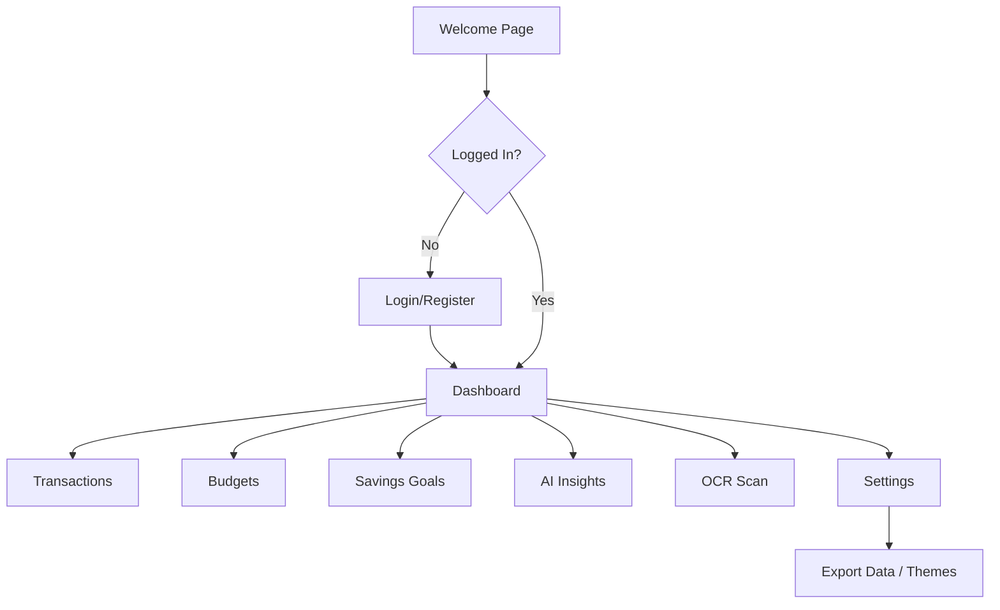
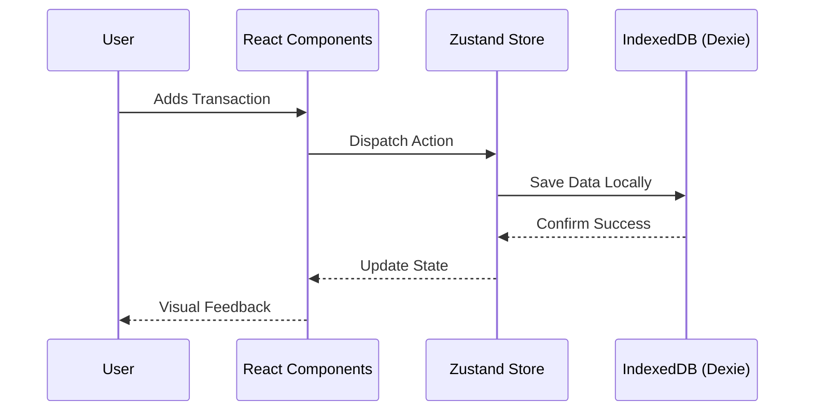

# Project Report: Lunaris

---

## 1. Title Page

**Project Title:** Lunaris - Your Calm, Clear Finance Companion  
**Student Name:** [Your Name]  
**Student ID:** [Your ID]  
**Department:** [Your Department]  
**Course Name & Code:** [Course Name & Code]  
**University Name:** [University Name]  
**Submission Date:** January 20, 2026

---

## 2. Abstract

**Lunaris** is a modern, privacy-focused personal finance application designed to empower individuals to take complete control of their financial lives. The primary purpose of the project is to provide a secure and beautiful interface for tracking income, expenses, budgets, and savings goals without compromising user privacy. 

**Front-end technologies used:** Next.js 16 (App Router), React 19, Tailwind CSS 4, Framer Motion for animations, and Recharts for data visualization.  
**Type of data handling:** The application uses **IndexedDB** (via Dexie.js) for robust local data handling, ensuring that all sensitive financial information remains exclusively on the user's device.  
**Main features and outcome:** Key features include multi-role authentication, a comprehensive financial dashboard, transaction management, budget tracking, savings goals, AI-powered financial insights, receipt scanning (OCR), and multi-language/multi-currency support. The project results in a fully functional Progressive Web Application (PWA) that offers a seamless, offline-first experience.

---

## 3. Introduction

### 3.1 Background
In an era where digital privacy is increasingly scarce, traditional personal finance applications often require users to sync their bank accounts and store sensitive financial data on remote servers. This dependency introduces potential security risks and privacy concerns.

### 3.2 Problem Statement
Existing finance applications often sacrifice user privacy for convenience, or they present complex, overwhelming interfaces that discourage regular use. There is a need for a tool that balances powerful financial tracking with uncompromising privacy and a serene user experience.

### 3.3 Objectives
- To develop a privacy-first finance application where data never leaves the user's device.
- To provide an intuitive and beautiful UI/UX that makes financial management "calm and clear."
- To implement advanced features like AI insights and receipt scanning using local-first technologies.
- To support global users through multi-currency and multi-language capabilities.

### 3.4 Scope of the Project
The scope includes building a web-based platform that handles the full lifecycle of personal finance management—from daily expense tracking to long-term savings goal achievement—while leveraging modern web technologies like PWAs to provide a native-app-like experience.

---

## 4. Related Work / Existing System

### 4.1 Overview of Similar Front-End Applications
Existing solutions like Mint (now part of Credit Karma), YNAB (You Need A Budget), and PocketGuard provide robust tracking and budgeting features. These applications typically use cloud-based architectures to sync data across devices.

### 4.2 Limitations of Existing Solutions
- **Privacy Risks:** Data stored on external servers is vulnerable to breaches.
- **Internet Dependency:** Most cloud-based apps have limited functionality offline.
- **Subscription Models:** Many premium features are locked behind monthly fees.
- **Complexity:** Some platforms have a steep learning curve for casual users.

### 4.3 Motivation for the Proposed System
The motivation for **Lunaris** stems from the desire to create a "digital vault" for personal finances. By using local storage and modern front-end frameworks, we can provide a high-performance tool that respects user autonomy and works instantly, anywhere.

---

## 5. Requirement Analysis

### 5.1 Functional Requirements
- **User Interaction:** Interactive charts, smooth transitions, and responsive modals.
- **Data Input and Validation:** Secure forms for adding transactions, budgets, and goals with real-time validation.
- **CRUD Operations:** Complete Create, Read, Update, and Delete capabilities for all data types (Transactions, Categories, Budgets, Goals).
- **AI Insights:** Automated analysis of spending patterns to provide personalized financial advice.
- **OCR Scanning:** Ability to scan receipts and extract text using Tesseract.js.

### 5.2 Non-Functional Requirements
- **Responsiveness:** Fully adaptive design for mobile, tablet, and desktop.
- **Performance:** Fast load times and near-instant transitions using Next.js optimization.
- **Usability:** High-contrast text, intuitive navigation, and support for Bangla and English.
- **Browser Compatibility:** Optimized for modern browsers supporting IndexedDB and ES6+.

### 5.3 Hardware Requirements
- CPU: 2GHz+ Processor
- RAM: 4GB minimum
- Storage: 100MB+ available (for local database growth)
- Camera (Optional): For receipt scanning feature

### 5.4 Software Requirements
- Operating System: Windows, macOS, Linux, Android, or iOS
- Modern Web Browser: Chrome, Firefox, Safari, or Edge
- Node.js (for development/deployment)

---

## 6. System Design

### 6.1 Application Flow Diagram



### 6.2 UI Wireframes / Page Layout Design
The design follows a **Glassmorphism** aesthetic with vibrant gradients and subtle shadows.
- **Layout:** Sidebar navigation on desktop, bottom navigation on mobile.
- **Theme:** Support for High-Contrast Dark Mode and elegant Light Mode.

### 6.3 Data Flow Design
Data flows through a centralized state management system (Zustand) which persists data to **IndexedDB via Dexie.js**.



### 6.4 Database Design
Lunaris uses a schema-based local database.
- **Tables:** `transactions`, `categories`, `budgets`, `goals`, `goalContributions`, `settings`, `recycleBin`.
- **Relationships:** Transactions are linked to Categories by `categoryId`. Goals track contributions via `goalId`.

---

## 7. Technology Stack

### 7.1 Front-End Technologies
- **HTML5 & CSS3:** Semantic structure and custom styling.
- **JavaScript (ES6+):** Modern logic and asynchronous handling.
- **Next.js 16:** React framework for routing and optimization.
- **Tailwind CSS 4:** Utility-first styling for rapid, consistent design.
- **Framer Motion:** High-performance animations and micro-interactions.

### 7.2 Data Management
- **Dexie.js:** A wrapper for IndexedDB for robust local storage.
- **Zustand:** Lightweight and fast state management.

### 7.3 Backend (Optional/Not Used)
*Note: Lunaris is intentionally offline-first. No traditional backend (PHP/MySQL) is required for core functionality, though it can be added for optional cloud sync in the future.*

### 7.4 Tools & Platforms
- **VS Code:** Primary code editor.
- **Browser DevTools:** For debugging and performance profiling.
- **Netlify:** For hosting the live demonstration.
- **XAMPP (Optional):** If legacy PHP/MySQL integration is testing.

---

## 8. Implementation

### 8.1 Project Folder Structure
```text
/src
  /app           - Next.js App Router (Pages & Layouts)
  /components    - Reusable UI Components
    /ui          - Shadcn/Radix UI base components
    /dashboard   - Dashboard specific widgets
    /auth        - Login/Register components
  /lib           - Core logic & Utilities
    /db          - Dexie database initialization
    /stores      - Zustand state stores
    /ai          - Financial insight logic
    /ocr         - Tesseract.js integration
  /public        - Static assets (images, icons)
```

### 8.2 Page-wise Implementation
- **Home Page:** Animated landing page with feature deep-dives.
- **Form Pages:** Dynamic forms with Radix UI components (Select, Input, DatePicker).
- **Dashboard:** Central hub utilizing Recharts for visual feedback.

### 8.3 JavaScript Logic
- **Event handling:** Efficient React event delegation.
- **DOM manipulation:** Governed by React's virtual DOM for performance.
- **Data processing:** Using custom hooks (`useTransactions`, `useBudgets`) to filter and aggregate financial data.

### 8.4 Data Storage Implementation
- **IndexedDB:** Handles bulk transaction data.
- **LocalStorage:** Used for lightweight flags (e.g., "first-time-user").

---

## 9. Testing & Results

### 9.1 Testing Strategy
- **Manual Testing:** Verifying user flows (adding/deleting transactions, changing settings).
- **Responsive Testing:** Using Chrome DevTools to simulate various mobile devices.
- **Storage Testing:** Verifying data persistence after browser restart.

### 9.2 Test Case Summary
| Test Case | Description | Expected Result | Status |
|-----------|-------------|-----------------|--------|
| TC-01 | Add Transaction | Entry appears in list and updates balance | Pass |
| TC-02 | Set Budget | Progress bar reflects spending vs limit | Pass |
| TC-03 | Theme Toggle | Switch between Dark and Light mode instantly | Pass |
| TC-04 | AI Insight | Generates feedback based on high spending | Pass |

### 9.3 Output Screens & Results
*Screenshots should be attached here showing the Dashboard, Transaction History, and Settings page.*

---

## 10. Advantages & Limitations

### 10.1 Advantages
- **Lightweight:** Minimal bundle size for fast loading.
- **Fast UI response:** No server round-trips for data operations.
- **Offline support:** Fully functional without an internet connection.
- **Unhackable Storage:** Data is stored locally, reducing the risk of mass data breaches.

### 10.2 Limitations
- **Browser-Specific:** Data is not automatically synced across different devices (e.g., Phone to PC).
- **Storage Constraints:** Limited by browser's allotted IndexedDB quota.
- **Manual Backups:** Users must manually export data if they clear their browser cache completely.

---

## 11. Conclusion & Future Work

### 11.1 Conclusion
**Lunaris** successfully demonstrates that a high-end, feature-rich financial tool can be built using an offline-first, privacy-centric approach. By leveraging the latest front-end technologies, the project provides a professional-grade experience that respects user data ownership.

### 11.2 Future Enhancements
- **Multi-Device Sync:** Implementing optional, end-to-end encrypted cloud synchronization.
- **Mobile Native App:** Using React Native or Capacitor to bring Lunaris to App Stores.
- **Bank Statement Import:** Adding support for parsing CSV/EXCEL files from major banks.
- **Enhanced AI:** Integrating advanced LLM models for deeper financial planning.

---
**Report generated for:** Maria Nusrat  
**Project:** Lunaris (v0.1.0)
